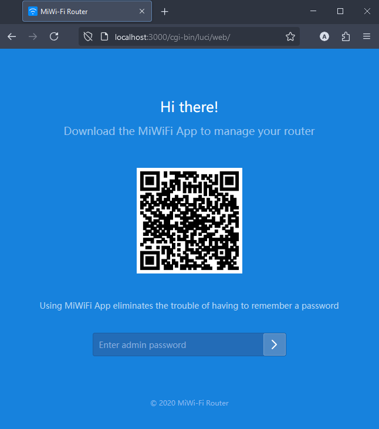

# Xiaomi router honeypot

Replicates the login page of the MiWi-Fi Router.

On login requests, it always throws an invalid credentials error, sends an email notification, and logs client information into a file.

Also, the program checks ports 1-1023 for scanning. If the client requests more than 3 ports in 5 seconds, it will be reported via email.

## Screenshots

### Appearance

Original MiWi-Fi page:


Replicated page (look at the URL address):



### Attempt of login

Log file output after an attempt of sign in into the router dashboard:


Email notification:


### Port scanning

Log file output after executing `nmap -p 1-100`:


Email notification:


## Setup

1. Clone the repository
2. Install dependencies with `npm install`
3. In project root, create a `.env` file with these keys:

```
EMAIL_ADDRESS=
EMAIL_PASSWORD=
EMAIL_SEND_TO=
```

Note: if you use Gmail as an email provider, generate an app password here: <https://myaccount.google.com/apppasswords>

3. Run `npm start`
4. Open `http://localhost` in browser
