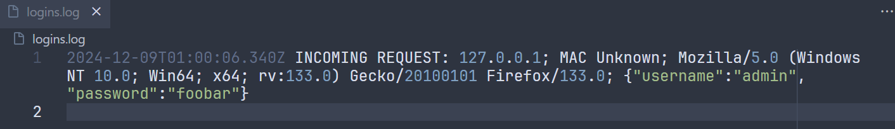
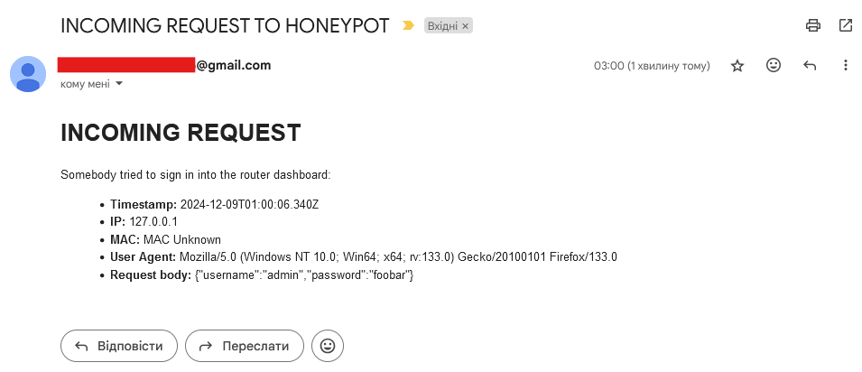

# Xiaomi router honeypot

Replicates the login page of the MiWi-Fi Router.

On login requests, it always throws an invalid credentials error, sends an email notification, and logs client information into a file.

Also, it checks some ports for scanning.

## Screenshots

### Appearance

Original MiWi-Fi page:


Replicated page (look at the URL address):


### Attempt of login

Console output after an attempt of sign in into the router dashboard:



Email notification:



### Port scanning

Console output after executing `curl http://localhost:8080` (MAC is null because the request is from the same device where the server is hosted):


Email notification:


## Setup

1. Clone the repository
2. Install dependencies with `npm install`
3. In project root, create a `.env` file with these keys:

```
EMAIL_ADDRESS=
EMAIL_PASSWORD=
EMAIL_SEND_TO=
```

Note: if you use Gmail as an email provider, generate an app password here: <https://myaccount.google.com/apppasswords>

3. Run `npm start`
4. Open `http://localhost` in browser
